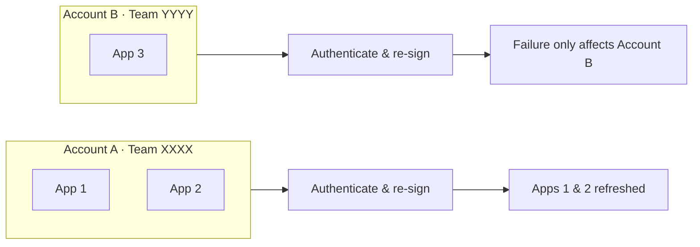
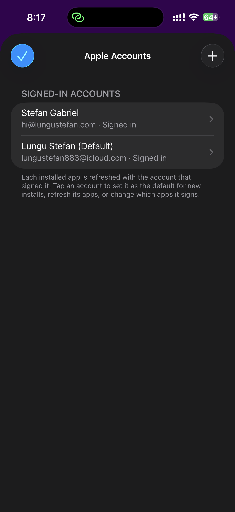
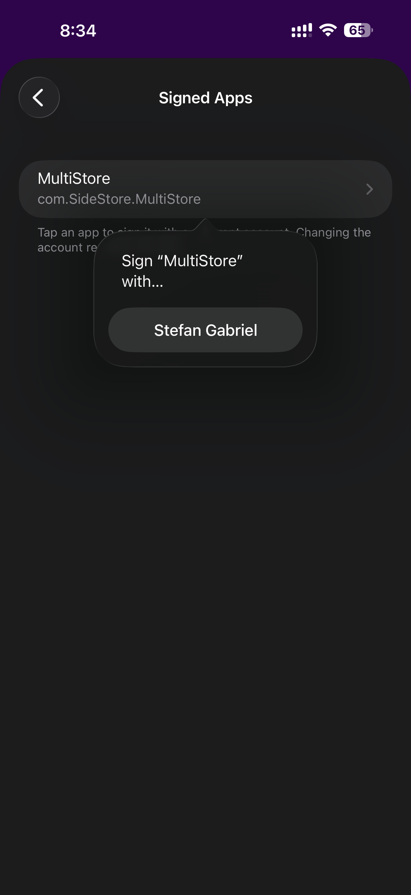
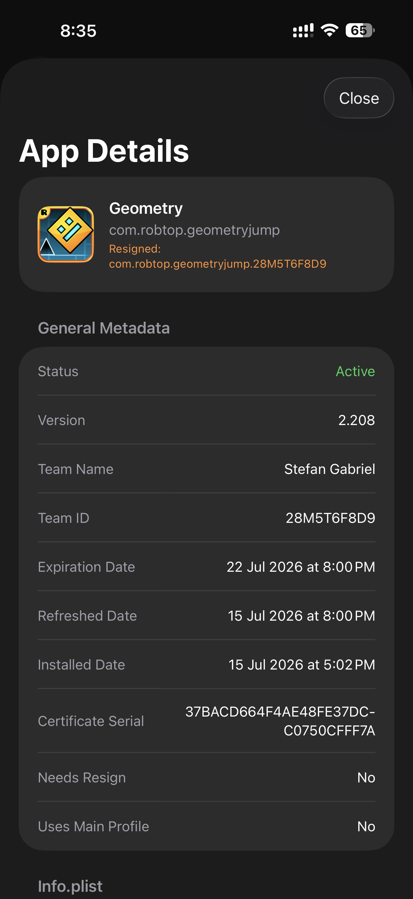

# MultiStore

> A **multi-account** fork of [SideStore](https://github.com/SideStore/SideStore) — sideload and refresh apps across **several Apple IDs at once**, from one app.

MultiStore is a fork of SideStore that removes its single-Apple-ID limitation. You can add **multiple Apple accounts**, and every installed app **permanently remembers which account signed it**, so **refreshes always use the correct account**. A problem with one account (expired session, revoked certificate, reached the app limit) only affects *that account's* apps — all other accounts continue refreshing normally.

It's aimed at anyone who regularly sideloads **more apps than a single free Apple ID allows**, or who wants to manage multiple signing identities from one installation.

It uses its own bundle identifier (**MultiStore**, `com.SideStore.MultiStore`), so it can live **side-by-side with a normal SideStore install** without conflicts.

Everything SideStore already does still applies — untethered sideloading with just your Apple ID, on-device resigning via a [custom VPN](https://github.com/SideStore/em_proxy) + [minimuxer](https://github.com/SideStore/minimuxer), and automatic background refresh to beat the 7-day expiry. MultiStore extends SideStore with a *multi-account signing layer* while leaving the existing sideloading, refresh, and VPN workflow unchanged.

## Why multiple accounts?

Each free Apple ID is limited to **three active apps** and a **seven-day** signing certificate. With several accounts you effectively get **more total app slots and staggered expirations**, all managed from a single app — instead of juggling separate installs.

> [!IMPORTANT]
> MultiStore does **not** bypass Apple's free developer restrictions. Each Apple ID is still limited to three active apps and seven-day certificates — MultiStore simply manages multiple *legitimate* Apple IDs from one application.

| Feature | AltStore | SideStore | MultiStore |
| --- | :---: | :---: | :---: |
| In-app refresh (no AltServer / no computer) | ❌ | ✅ | ✅ |
| Multiple Apple IDs | ❌ | ❌ | ✅ |
| More than 3 apps (using multiple free accounts) | ❌ | ❌ | ✅ |
| Per-app signing account | ❌ | ❌ | ✅ |
| Independent per-account refresh | ❌ | ❌ | ✅ |
| Failure isolation | ❌ | ❌ | ✅ |
| Side-by-side install (with SideStore) | ❓ | — | ✅ |

❓ possible but unverified &nbsp;·&nbsp; — not applicable (installing SideStore beside SideStore makes no sense)

## What's different from SideStore

- **Multiple Apple Developer accounts** with isolated authentication sessions, certificates, teams and credentials.
- **Permanent app → account binding** — each `InstalledApp` stores a `signingAccountID`; refreshes are **partitioned per account** and run independently.
- **Failure isolation** — one account failing never stops the others from refreshing.
- **Automatic in-app upgrade** — updating MultiStore converts any existing single-account data in its *own* store to the multi-account model in place, with no data loss (it does not import a separate SideStore install — see the [FAQ](#faq)).
- **Minimal account UI** — add / remove / view accounts and their status in Settings, set a default account, and change any app's signing account.
- **Coexists with SideStore** — distinct bundle identifier, display name, keychain namespace and app group.

Deep dives:
- [`docs/multi-account/ARCHITECTURE.md`](./docs/multi-account/ARCHITECTURE.md) — how SideStore's single-account assumptions were analyzed.
- [`docs/multi-account/PLAN.md`](./docs/multi-account/PLAN.md) — the implementation plan, data-model change and migration strategy.

## Architecture

Each app is bound to the account that signed it (`signingAccountID`). At refresh time apps are grouped by account, and each account is authenticated and re-signed **independently** — so one account's failure is isolated to its own apps.

## Screenshots

<table>
  <tr>
    <td align="center"></td>
    <td align="center"></td>
    <td align="center"></td>
  </tr>
  <tr>
    <td align="center">Multiple Apple accounts signed in</td>
    <td align="center">Move a signed app to another account</td>
    <td align="center">Each app records the account that signed it</td>
  </tr>
</table>

The sideloaded app shown is <em>Geometry Dash</em> — © <a href="https://www.robtopgames.com">RobTop Games</a>, used here only to illustrate the UI. (For the record: I own it on Steam and Google Play — I just wasn't going to pay for it a third time on a third store 😉)

## Requirements

- macOS with **Xcode 16+** (the project uses file-system-synchronized groups)
- **iOS 15+** target device
- See [CONTRIBUTING.md](./CONTRIBUTING.md) for the full local build setup

## Building & CI

The app can only be built on macOS. Every push and pull request is automatically built by GitHub Actions: the [`multi-account-ci.yml`](./.github/workflows/multi-account-ci.yml) workflow builds the archive
(no signing required) and uploads an installable `SideStore-multi-account.ipa` artifact. Grab the IPA
from the latest green run under the repo's **Actions** tab.

## Installing on your device

The CI IPA is unsigned, so you sideload it with **your own Apple ID** (which re-signs it).

**Recommended: [iLoader](https://github.com/nab138/iloader)** ([iloader.app](https://iloader.app)) — a free, open-source sideloader that installs the IPA *and* manages the pairing file MultiStore needs.

1. Download `SideStore-multi-account.ipa` from the latest green Actions run and unzip it.
2. In **iLoader**, sign in with your Apple ID and install `SideStore.ipa` (this re-signs it for your device).
3. Launch MultiStore. When it asks for a **pairing file**:
   - In **iLoader**, click **Manage Pairing File → Export**.
   - Transfer the exported file to your iPhone (AirDrop / iCloud Drive / email / the Files app).
   - In MultiStore, **import** that file when prompted — this is required for installing/refreshing to actually work.
4. Allow the **VPN** MultiStore installs, and enable **Developer Mode** (Settings → Privacy & Security, iOS 16+).

It appears as **MultiStore** on your Home Screen, alongside any existing SideStore.

Other sideloaders ([Sideloadly](https://sideloadly.io), [AltServer](https://altstore.io)) also work; the pairing-file idea is the same — see the [SideStore docs](https://docs.sidestore.io/docs/advanced/pairing-file) for background.

> Tip: when updating, re-sideload **over** the existing app with the **same** Apple ID — don't delete it first — so your added accounts and app data are preserved.

## Using multiple accounts

1. **Settings → tap your account (ACCOUNT section)** → **`+` Add Account** and sign in with another Apple ID.
2. New installs are signed with your **default** account; each app then refreshes with the account that signed it.
3. To move an app to a different account: open an account → **Manage Signed Apps** → pick the app → choose another account (it re-signs it).

> Note: due to an Apple authentication quirk, the **first attempt** to add an Apple account sometimes errors out — just tap **Add Account** and try again; the second attempt goes through.

## Notes & known quirks

- **It still calls itself "SideStore" internally.** Only the Home Screen name and bundle identifier are "MultiStore" (`com.SideStore.MultiStore`). The Xcode scheme, build artifacts (`SideStore.ipa` / `SideStore.app`), the internal product name and various log lines still say "SideStore" — this is intentional, so the build tooling and upstream compatibility stay intact.
- **"Re-sign / rebase signing key" prompt during Refresh All — you can safely refuse it.** If you run *Refresh All* while your **default account is not the account that signed MultiStore itself**, MultiStore may warn that its own signing certificate doesn't match and offer to re-sign ("rebase") its key. **Decline it — it's cosmetic.** MultiStore itself is still refreshed and re-signed with **its own correct certificate** (the account that originally signed it), *not* the currently-selected default account's — exactly like every other app, each of which is re-signed with the key of the account that signed it. To avoid the prompt entirely, keep the account that signed MultiStore as your default (or refresh each account's apps from its own entry in the accounts screen).

## Credits & acknowledgements

MultiStore stands entirely on the shoulders of these projects:

- **[SideStore](https://github.com/SideStore/SideStore)** — the base this fork is built on.
- **[AltStore](https://github.com/rileytestut/AltStore)** by Riley Testut — which SideStore itself forked.
- [em_proxy](https://github.com/SideStore/em_proxy), [minimuxer](https://github.com/SideStore/minimuxer), [AltSign](https://github.com/SideStore/AltSign), [Jitterbug](https://github.com/osy/Jitterbug), and [Roxas](https://github.com/rileytestut/roxas).

The multi-account layer is the only substantive addition here; all sideloading/refresh/VPN machinery is SideStore's work.

## FAQ

### Does this bypass Apple's limits?

No. Each Apple ID is still subject to Apple's normal free-developer restrictions (three active apps, seven-day certificates). MultiStore simply manages multiple *legitimate* Apple accounts independently from one app — it doesn't circumvent anything.

### Why multiple Apple IDs instead of one paid Developer account?

MultiStore works with **both** free and paid Apple Developer accounts. Multiple accounts are primarily useful for users on **free** Apple IDs, which Apple limits to three active apps and seven-day certificates each. A paid Apple Developer Program membership removes those three-app and seven-day signing restrictions, making multiple accounts less necessary — but MultiStore lets several free accounts add up for those who'd rather not pay.

### Can I use it alongside SideStore?

Yes. MultiStore installs under its own identity (`com.SideStore.MultiStore`), so it coexists with a normal SideStore install without conflicts.

### Can I import my existing SideStore setup?

No — MultiStore is a **separate app** (its own bundle identifier, app group and keychain), so it can't read a stock SideStore install's accounts or apps. Set MultiStore up fresh: add your Apple account(s) and install your apps in it. Your existing SideStore keeps working, untouched and independent.

### Why doesn't MultiStore import my SideStore data?

iOS isolates every app's sandbox, keychain access groups and app groups. Because MultiStore intentionally uses *different* identifiers so it can coexist with SideStore, iOS won't let it read SideStore's data — that isolation is exactly what makes side-by-side installs possible.

### What does "automatic migration" mean, then?

It's internal only: when you **update MultiStore itself**, any existing single-account data in *its own* store is upgraded to the multi-account model automatically (no re-login, no lost apps). It never pulls data from a separate SideStore install.

### Is this affiliated with SideStore or AltStore?

No. It's an independent, community fork that builds on their work (see [Credits](#credits--acknowledgements)).

## Contributing

Contributions are welcome! Please see [CONTRIBUTING.md](./CONTRIBUTING.md).

## License

This project is licensed under the **AGPLv3 license**, inherited from SideStore. See [LICENSE](./LICENSE).
